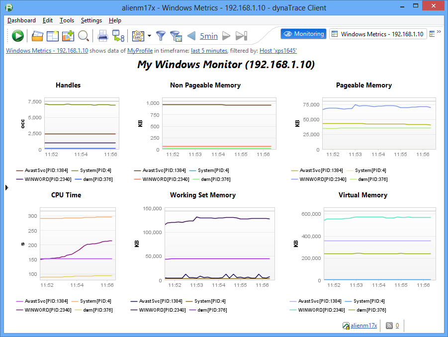
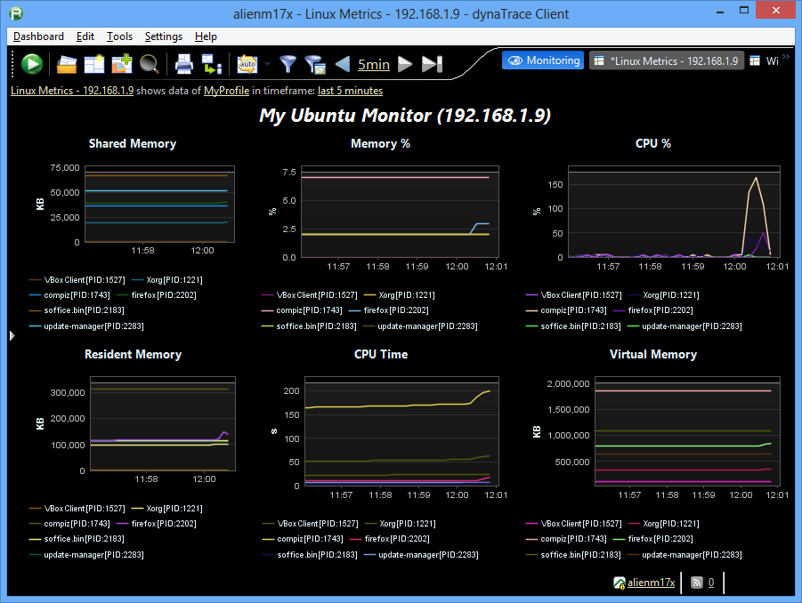

<html xmlns="http://www.w3.org/1999/xhtml">
<head>
    <title>Top Process Monitoring Plugin</title>
    <meta http-equiv="Content-Type" content="text/html; charset=UTF-8"/>
    <meta http-equiv="X-UA-Compatible" content="IE=EmulateIE8" />
    <meta content="Scroll Wiki Publisher" name="generator"/>
    <link type="text/css" rel="stylesheet" href="css/blueprint/liquid.css" media="screen, projection"/>
    <link type="text/css" rel="stylesheet" href="css/blueprint/print.css" media="print"/>
    <link type="text/css" rel="stylesheet" href="css/content-style.css" media="screen, projection, print"/>
    <link type="text/css" rel="stylesheet" href="css/screen.css" media="screen, projection"/>
    <link type="text/css" rel="stylesheet" href="css/print.css" media="print"/>
</head>
<body>
                <h1>Top Process Monitoring Plugin</h1>
    

        <h2>Overview</h2>
    

            
            

    

            
        The Top Process Monitor plugin enables monitoring processes consuming the most CPU Time and/or Resident/WorkingSet memory and stores the process name as a dynamic measure.    

    

Windows measures are collected through Powershell, so these measures must be executed from a Windows Collector.    

    

Linux measures are collected through SSH, and can be collected from both Windows or Linux collectors.    

    

    

        <h2>Plugin Details</h2>
    

        <table>
<thead class=" "></thead><tfoot class=" "></tfoot><tbody class=" ">    <tr>
            <td rowspan="1" colspan="1">
        

Plug-In Files    

            </td>
                <td rowspan="1" colspan="1">
        

<strong class=" ">dynaTrace 5.0+</strong>:    

            </td>
        </tr>
</tbody>        </table>
            

    

<a href="attachments_137757091_1_br.com.compuware.topplugin_1.0.2.jar">Top Monitor Plugin 1.0.2</a> <a href="attachments_121569464_1_Windows_Top_Processes_Dashboard.dashboard.xml">Top Plugin Monitor Dashboard - Windows</a> <a href="attachments_121569465_1_Linux_Top_Processes_Dashboard.dashboard.xml">Top Plugin Monitor Dashboard - Linux</a>    

    

        <table>
<thead class=" "></thead><tfoot class=" "></tfoot><tbody class=" ">    <tr>
            <td rowspan="1" colspan="1">
        

Author    

            </td>
                <td rowspan="1" colspan="1">
        

<a href="https://community/display/~Paul.Kuit@compuware.com">Paul Kuit</a>    

            </td>
        </tr>
    <tr>
            <td rowspan="1" colspan="1">
        

dynaTrace Versions    

            </td>
                <td rowspan="1" colspan="1">
        

4.2, 5.x    

            </td>
        </tr>
    <tr>
            <td rowspan="1" colspan="1">
        

License    

            </td>
                <td rowspan="1" colspan="1">
        

<a href="attachments_5275722_2_dynaTraceBSD.txt">dynaTrace BSD</a>    

            </td>
        </tr>
    <tr>
            <td rowspan="1" colspan="1">
        

Support    

            </td>
                <td rowspan="1" colspan="1">
        

<a href="https://community/display/DL/Support+Levels">Not Supported</a>    

            </td>
        </tr>
    <tr>
            <td rowspan="1" colspan="1">
        

Known Problems    

            </td>
                <td rowspan="1" colspan="1">
        

    

            </td>
        </tr>
    <tr>
            <td rowspan="1" colspan="1">
        

Release History    

            </td>
                <td rowspan="1" colspan="1">
        

2013-21-05 1.0.0 Initial Release 2013-22-05 1.0.1 Number Format fix    

    

2013-12-09 1.0.2 Gigabyte fix    

            </td>
        </tr>
</tbody>        </table>
            

    

    

        <h2>Provided Measures</h2>
    

        <h3>Both Windows and Unix:</h3>
<ul class=" "><li class=" ">    

CPUTime (s)    

</li><li class=" ">    

Resident/Workingset memory (kB)    

</li><li class=" ">    

Virtual Memory (kB)    

</li></ul>    

    

        <h3>Linux only:</h3>
<ul class=" "><li class=" ">    

CPU (%)    

</li><li class=" ">    

Memory (%)    

</li><li class=" ">    

Shared Memory (kB)    

</li></ul>    

    

        <h3>Windows only:</h3>
<ul class=" "><li class=" ">    

Handles (occ)    

</li><li class=" ">    

Non Pageable Memory - NPM (kB)    

</li><li class=" ">    

Pageable Memory - PM (kB)    

</li></ul>    

<strong class=" ">DO NOT SUBSCRTIBE LINUX SPECIFIC MEASURES TO A MONITOR CONFIGURED FOR WINDOWS HOSTS OR WINDOWS SPECIFIC MEASURES TO A MONITOR FOR LINUX HOST. THE PLUGIN WILL VERIFY THIS AND FAIL TO SETUP.</strong>    

    

    

        <h3>Configuration Top Monitor</h3>
    

The monitor requires the following configuration settings:    

<ul class=" "><li class=" ">    

ssh-username: (Linux only) The username used to logon through SSH    

</li><li class=" ">    

ssh-password: (Linux only) The password used to logon through SSH    

</li><li class=" ">    

operatingSystem: Select (Windows/Linux) the operating system of the monitored hosts within this monitor. Create different monitors for Unix and Windows destination hosts.    

</li><li class=" ">    

topMemory: The amount of processes to collect consuming most Resident (or Working set) memory. Should be less then the total amount of processes running on the host.    

</li><li class=" ">    

topCPU: The amount of processes to collect consuming top CPU Time.    

</li></ul>    

Values topCPU=5, topMemory=5 could bring up 10 dynamic measures for each host since most consuming memory processes are not necessarily most CPU consuming. If only interested in top memory consuming, define topCPU=0 and vice versa.    

    

    

        <h3>Installation</h3>
    

Import the Plugin into the dynaTrace Server via the dynaTrace Server Settings menu -&gt; Plugins -&gt; Install Plugin. For details how to do this please refer to the <a href="https://community.dynatrace.com/community/display/DOCDT32/Manage+and+Develop+Plugins#ManageandDevelopPlugins-ManageandDevelopPlugins">dynaTrace documentation</a>.    

    

To use the provided dashboards please open the Dashboard and set the Data Source accordingly.    

    

    

        <h3>Access Requirements</h3>
    

        <h4>Windows</h4>
    

Windows measure collections are only available for Collectors running on Windows, since it uses the following command:    

    

                

        <pre><code>powershell invoke-command -computer &lt;IP_ADDRESS&gt; &quot;{get-process | fl ProcessName, ID, Handles, NPM, PM, WS, VM, CPU}&quot;</code></pre>
        

    

    

Make sure powershell&acute;s remote execution is enabled on the remote machine by executing:    

    

                

        <pre><code>powershell enable-psremoting -force</code></pre>
        

    

    

In case of AccessDenied errors, try execute the `powershell invoke-command` from the collector with the same user running the Collector process.    

    

    

        <h4>Linux</h4>
    

Linux measures are queried through SSH by executing command:    

    

                

        <pre><code>&quot;top -n 1 -b&quot;</code></pre>
        

    

    

Make sure SSH is installed on the Linux destination machine and the ssh-username have access rights.    

    

    

    

        <h3>Usage Notes</h3>
    

The name of the dynamic measure contains only the name of the process. When creating a chart for a specific measure, select measure splitting 'processname' and filter the chart dashlet for the specific host or it will show processes from all monitored hosts within the monitor instance.    

    

    

            

        

        

        

    

</body>
</html>
